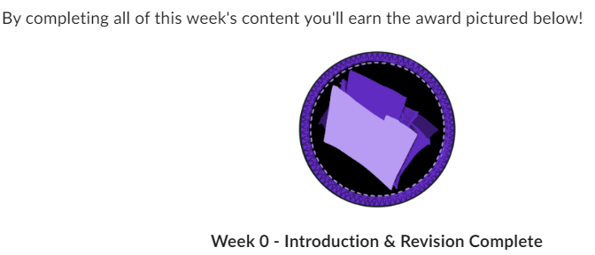
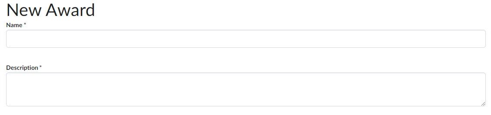
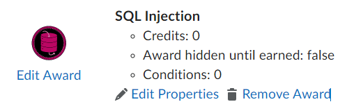
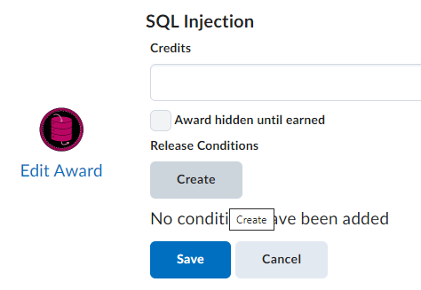
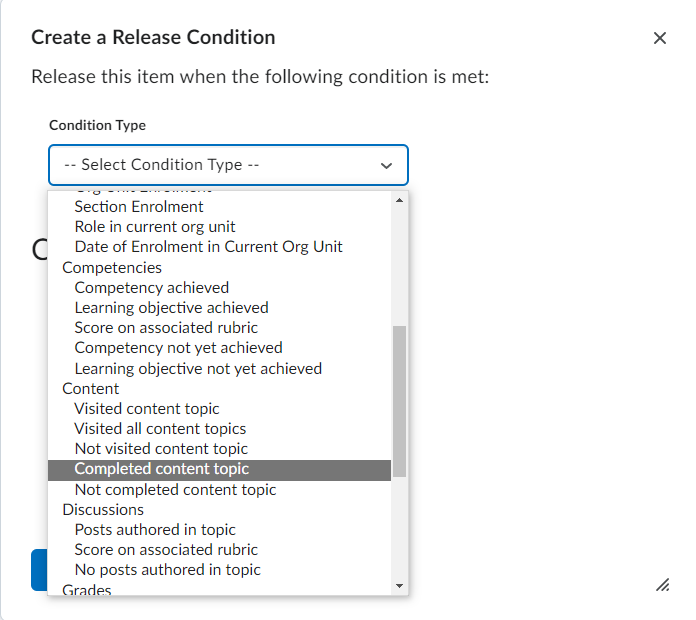
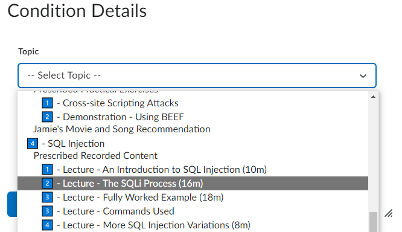
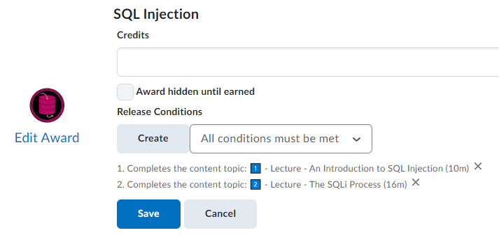

# Creating MLS Awards for 100% Topic Completion

Let's say you want to incentivise students to "complete" each activity you provide on MLS. One way to do this is through MLS' built in Awards system. However, this can prove more complex than originally percieved. So, I created this guide to help me remember how to do so.

## End Goal 
The end goal is something similar to the Figure below, a badge which unlocks after completing all topic activities.

## Step-by-Step Guide

### Step 1
Start by creating an Award via the "Grades and Progress" and "Awards" menu, fill out the details as you see fit.

### Step 2
Navigate to your new award to start "Edit Properties".

### Step 3
Start by creating new "Release Conditions"

### Step 4
In this new "Release Conditions" menu, there is the "Condition Type". The list of available types is fairly self explanatory, and if MLS was more refined it would include a 100% a topic condition, however, it currently does not. Therefore, instead you must use "Content" option called "Completed content topic".

### Step 5
After selecting this Condition Type, select the activity found within the Topic you are wanting a student to complete. Afterwards, select the create button.

### Step 6
Repeat steps 3 to 5 until you have selected all the activities you want completed to earn the award. However, once you have done more than one Release Condition, a new box appears! Ensure this is set to "all conditions must be met".

### Step 7
Once you have selected all the release conditions, hit save, and all eligable students will be awarded!
