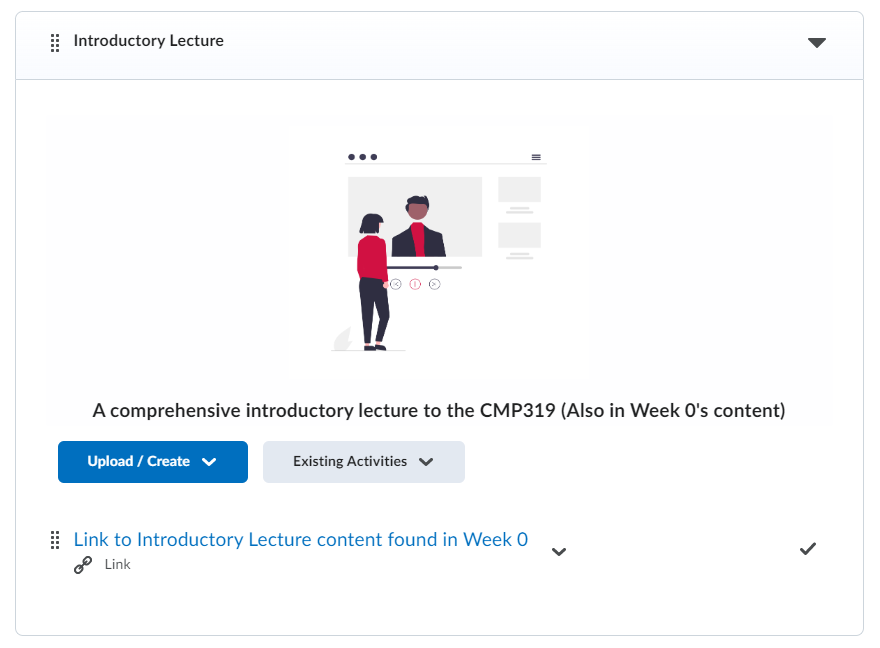
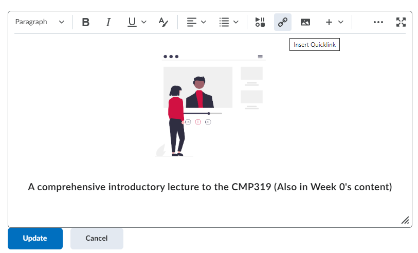
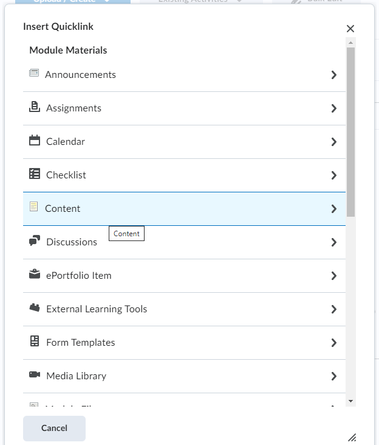
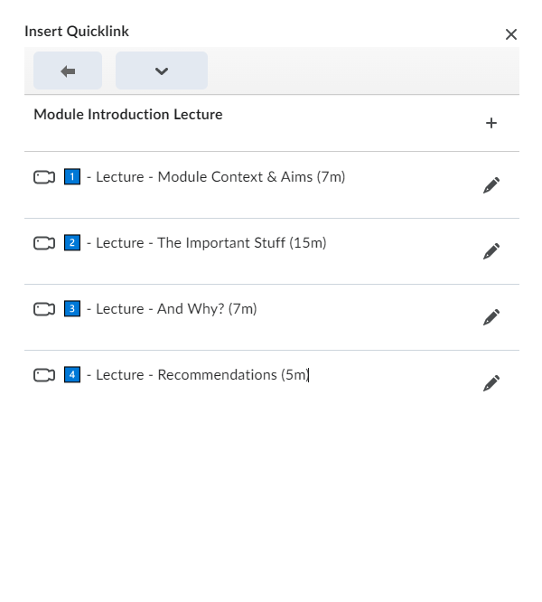
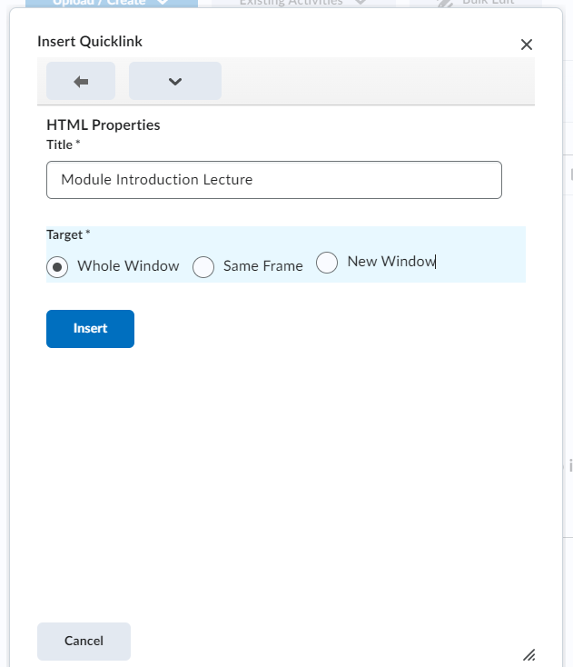
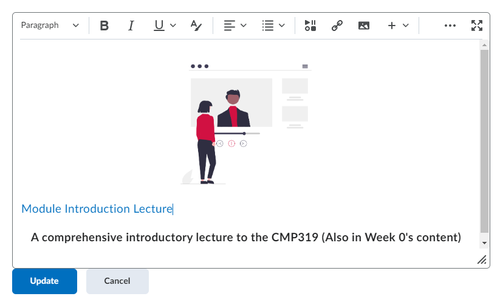
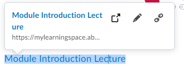
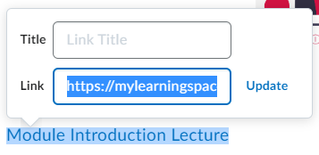

# Creating Permalinks to Other MLS Units as an Activity

If you want to link from one unit of an MLS Module page to another, how do you do it? I found myself asking this question, however, through trial and error along side some help from colleagues - I discovered a solution. This small post details this solution so you can use it too.

## End Goal 
The end goal is something similar to the Figure below, a link as an activity to another section of the same MLS module.

## Guide

### Step 1
Start by creating a "Quicklink" in an text editor section of MLS, for this example I have done so in a description of a subunit. 

### Step 2
Inside the "Insert Quicklink" menu, select content.  

### Step 3
Navigate the "Insert Quicklink" menu to find the content you wish to link. If you wish to link a specific activity use the "pencil" icon, however, if you wish to link the entire subunit use the "plus" icon.

### Step 4
Selecting the content you want, and you'll be presented with this HTML Properties page. Of importance is the "Target" option, this will determine the eventual Link's behaviour. If you want the activity to open a new browser tab, then select New Window, if you want the activity to redirect the user then use Whole Window. (Unsure what Same Frame would accomplish). Select whatever option best suits you, and click the insert button.

### Step 5
After clicking insert this will create a link in the text you were editing. As seen in the Figure below.

### Step 6
While remaining in editing mode, click the link to inspect an associated popup box as seen in the Figure below.

### Step 7
Click the "pencil" icon in this popup box to lead you to another perspective with Title and Link along side an update botton. Copy the URL found in the Link box, as seen in the Figure below.

### Step 8
Now start the process to create a Link activity in MLS. Do as you would normally do, however, this time insert the link copied in Step 7. And ta-da! You've now linked to another MLS unit from an activity.

